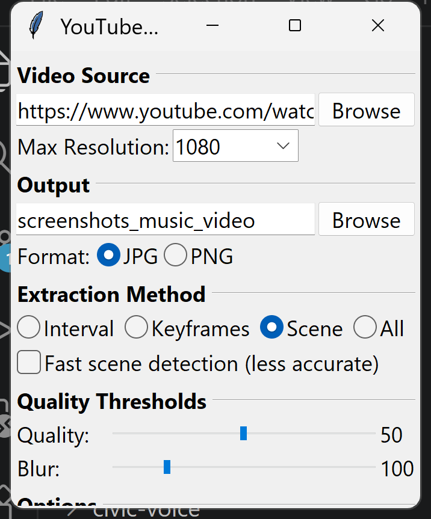
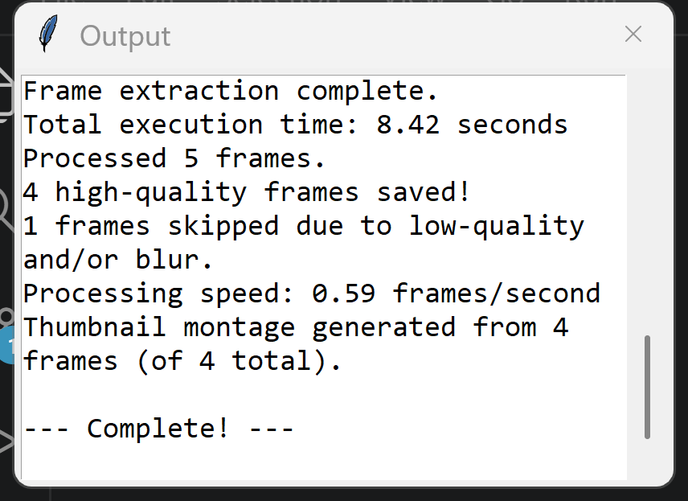

# YouTube Screenshot Extractor

Pull clean, high-quality still frames out of any video — YouTube, 1000+ other sites via yt-dlp, or a file already on your disk. Point it at a source, and it downloads (if needed), finds the best frames, filters out the blurry/low-quality ones, crops black bars, and saves the rest. Built for gathering training images for LoRAs and checkpoints, but works for any "grab good frames from a video" job.

<p align="center">
  
  
</p>

## Features

- **Any source** — YouTube plus 1000+ sites yt-dlp supports, or a local video file
- **Four extraction methods** — interval, every frame, keyframes only, or scene-change detection
- **Automatic quality control** — sharpness/blur and quality scoring filter out bad frames before they're saved
- **Black bar removal** — letterboxing and pillarboxing are cropped automatically
- **Watermark detection** — flags likely-watermarked frames in the filename
- **GUI and CLI** — a point-and-click interface for everyday use, a full-featured script for automation
- **YouTube authentication** — browser cookie support for age-restricted and private videos, plus rate limiting to avoid bans
- **Resume support** — pick a large extraction back up where it left off
- **Parallel processing** — streams frames through a worker pool instead of loading a whole video into memory, so long videos don't stall or run out of RAM

## Quick Start

### Windows
Double-click **`START.bat`**. First time, run in order:
- **[3] Initial Setup** — first time only
- **[4] Install Deno** — required for YouTube downloads
- **[5] Install FFmpeg** — required for keyframe extraction and some filters

Then use **[1] Launch GUI** to start. **[2] Check for Updates** pulls the latest tool code and refreshes yt-dlp and the other dependencies in one step — run it anytime, especially if it's been a while (option [6] shows CLI help).

### macOS / Linux
Run **`./start.sh`** — same menu, same steps.

## Requirements

- Python 3.10+
- [Deno](https://deno.land/) — **required for YouTube** (other sites don't need it)
  - `winget install DenoLand.Deno` (Windows) / `brew install deno` (macOS) / `curl -fsSL https://deno.land/install.sh | sh` (Linux)
- [FFmpeg](https://ffmpeg.org/download.html) — **required for keyframe extraction, gradfun/deband filters, and merging separate audio/video streams**
  - `winget install Gyan.FFmpeg` (Windows) / `brew install ffmpeg` (macOS) / `sudo apt install ffmpeg` (Linux)
  - Interval/scene/all extraction and the deblock filter work fine without it

Both are handled for you by the startup script menus above.

**Keep yt-dlp updated** — YouTube changes frequently, and yt-dlp updates to match. Use startup script option **[2] Check for Updates**, or `pip install --upgrade "yt-dlp[default]"`.

## Manual Installation

```bash
git clone https://github.com/EnragedAntelope/youtube-screenshot-extractor.git
cd youtube-screenshot-extractor
python -m venv venv
venv\Scripts\activate          # macOS/Linux: source venv/bin/activate
pip install -r requirements.txt
```
Then install Deno and FFmpeg as shown above.

### Running the tests

```bash
pip install pytest
python -m pytest tests -v
```

The unit tests cover the pure helpers (URL cleaning, extractor-arg parsing, black-bar cropping, resume bookkeeping, montage tiling, yt-dlp option building) and need neither Deno nor FFmpeg.

## Usage

### GUI (recommended)

```bash
python youtube-screenshot-gui.py
```

Every option is exposed with a tooltip, sensible defaults are pre-selected, and a live output log shows progress. A **Stop** button cancels a running extraction, and only one extraction runs at a time. The **YouTube Authentication** section also carries an advanced *Extractor Args* field (e.g. `youtube:player_client=mweb`) for the rare cases where yt-dlp needs a specific client.

### Command line

```bash
# Extract frames using scene detection from YouTube
python youtube-screenshot-script.py https://www.youtube.com/watch?v=VIDEO_ID --method scene

# Extract keyframes from a local file
python youtube-screenshot-script.py video.mp4 --method keyframes

# High-quality extraction with filters and a thumbnail preview
python youtube-screenshot-script.py video.mp4 --quality 50 --blur 100 --detect-watermarks --deblock --thumbnail

# Age-restricted video (needs authentication)
python youtube-screenshot-script.py "YOUTUBE_URL" --cookies-from-browser firefox

# Processing several videos back-to-back — add a delay to avoid rate limits
python youtube-screenshot-script.py "URL" --sleep-requests 5
```

## Options

| Option | Description | Default |
|--------|-------------|---------|
| `--method` | `interval`, `all`, `keyframes`, or `scene` | interval |
| `--interval` | Seconds between frames (interval method only) | 5.0 |
| `--quality` | Quality threshold 0-100 (higher = stricter) | 30.0 |
| `--blur` | Blur threshold (higher = less blur allowed) | 50.0 |
| `--max-resolution` | Limit download quality (e.g., 720, 1080) | best |
| `--output` | Custom output folder name | auto |
| `--png` | Save as PNG instead of JPG | JPG |
| `--detect-watermarks` | Enable watermark detection | off |
| `--watermark-threshold` | Watermark sensitivity 0-1 | 0.8 |
| `--fast-scene` | Faster but less accurate scene detection | off |
| `--resume` | Resume an interrupted extraction | off |
| `--thumbnail` | Generate a 3x3 thumbnail montage | off |
| `--keep-video` | Keep the downloaded source video (deleted after extraction by default) | off |
| `--verbose` | Log every frame individually (otherwise a progress bar / periodic summary) | off |
| `--dry-run` | Preview without downloading or processing | off |
| `--disable-parallel` | Process frames one at a time | off |
| `--config` | Load settings from a JSON file (keys match the option names; command-line flags still win) | none |
| `--gradfun` | Reduce color banding (subtle) | off |
| `--deblock` | Reduce compression artifacts | off |
| `--deband` | Reduce color banding (aggressive) | off |
| `--cookies-from-browser` | Use cookies from a browser (firefox, chrome, edge...) | none |
| `--cookies` | Path to a cookies file (Netscape format) | none |
| `--sleep-requests` | Delay in seconds between requests | 0 |
| `--extractor-args` | Additional yt-dlp extractor args, `EXTRACTOR:ARG=VALUE` (repeatable) | none |

## Output

Frames are saved as `frame_NNNNNN_qXX_bYY[_watermarked].(jpg|png)`:
- `NNNNNN` — frame number
- `XX` — quality score (0-100, higher is better)
- `YY` — blur score (higher = sharper)
- `_watermarked` — present if a watermark was detected

Both scores describe the frame **as cropped**, so they match the image on disk. They are measured before any optional `--gradfun`/`--deblock`/`--deband` filtering, because `--deblock` is a denoiser and lowers the blur score by design.

### Progress output

By default a terminal gets a progress bar, and piped output (including the GUI's log) gets a one-line summary every couple of seconds. Pass `--verbose` for a line per frame with its scores and skip reason — useful when tuning thresholds, but an `--method all` run over a few minutes of video emits tens of thousands of them.

## Tips

- **Speed**: `keyframes` is fastest, `scene` finds natural cuts, `interval`/`all` can be slow on long videos.
- **Keyframe mode extracts every I-frame directly via FFmpeg** and does *not* apply the quality/blur thresholds, watermark detection, post-processing filters, `--png`, or `--resume` — those only apply to the other methods. Output is always JPEG.
- **Default method**: the CLI defaults to `interval`; the GUI defaults to `scene` (a better starting point for most videos). Quality and blur thresholds are the same in both.
- **Downloaded videos are deleted after extraction** by default. Pass `--keep-video` (or tick *Keep video* in the GUI) to retain the source file.
- **Quality tuning**: the defaults (`--quality 30 --blur 50`) are a middle ground shared by the CLI and GUI. Raise toward `50`/`100` to be pickier, lower toward `12`/`10` to keep almost everything. Run with `--verbose` to see each frame's scores while tuning.
- **Long videos**: use `--resume` and cap resolution with `--max-resolution 1080`.
- **Filters**: `--gradfun` for subtle banding, `--deband` for severe banding — both add processing time.
- **Other sites**: most of yt-dlp's 1000+ supported sites work out of the box; some may not support every resolution option.

## YouTube Authentication & Rate Limits

YouTube requires **PO Tokens** for many downloads and enforces rate limits (~300 videos/hour for guests, ~2000/hour authenticated). If a download fails with a 403 error or a PO Token message, use browser cookies:

```bash
python youtube-screenshot-script.py "URL" --cookies-from-browser firefox
```

You need to be logged into YouTube in that browser (Firefox is recommended on Windows — Chrome encrypts its cookies). Age-restricted and private videos always require this.

To stay well under rate limits when processing multiple videos, add a delay and cap resolution:

```bash
python youtube-screenshot-script.py "URL" --sleep-requests 5 --max-resolution 720
```

⚠️ Using your main YouTube account with any download tool carries a small risk of account restrictions. Consider a throwaway/secondary account, stay under the rate limits above, and keep yt-dlp updated (`pip install --upgrade "yt-dlp[default]"`) since YouTube's requirements change frequently.

## Troubleshooting

| Problem | Solution |
|---------|----------|
| YouTube download fails | Update yt-dlp, add `--cookies-from-browser firefox`, and make sure Deno is installed |
| HTTP 403 / "Forbidden" | Use `--cookies-from-browser firefox` or `chrome` |
| Age-restricted video fails | `--cookies-from-browser firefox`, logged into YouTube in that browser |
| Rate limited / "content isn't available" | `--sleep-requests 5 --max-resolution 720` |
| "Format not available" | Remove `--max-resolution`, or try a different source |
| No frames extracted | Lower thresholds: `--quality 20 --blur 30`, and add `--verbose` to see each frame's scores |
| Keyframe extraction fails | Install FFmpeg and make sure it's on PATH |
| Scene detection slow/crashes | Use `--fast-scene`, or process shorter segments |
| False watermark positives | Raise `--watermark-threshold` to 0.9 |
| Process dies on large videos | Use `--resume`, check available disk space |
| Downloads ignore `--max-resolution` | Install FFmpeg — without it only single-stream formats are available, which limits the choice |

## License

MIT License - see [LICENSE](LICENSE)
